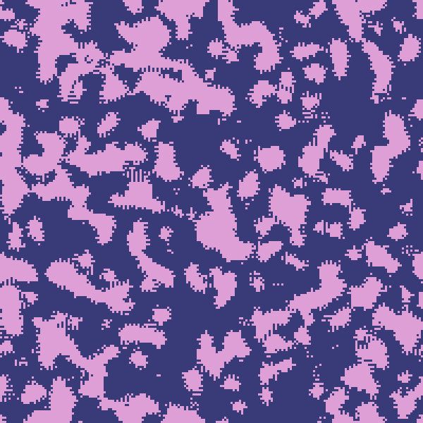
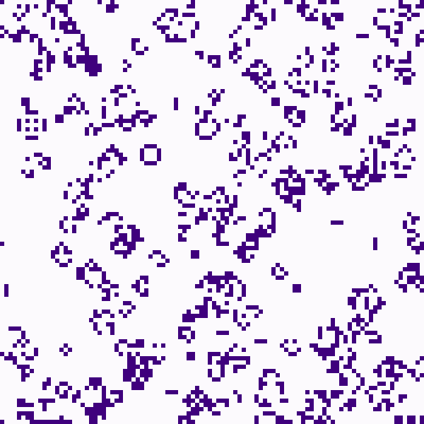
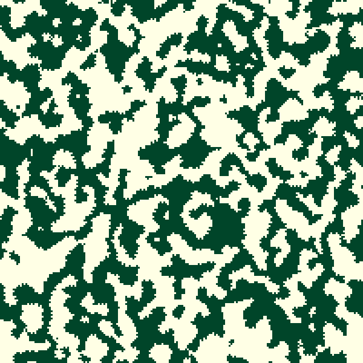
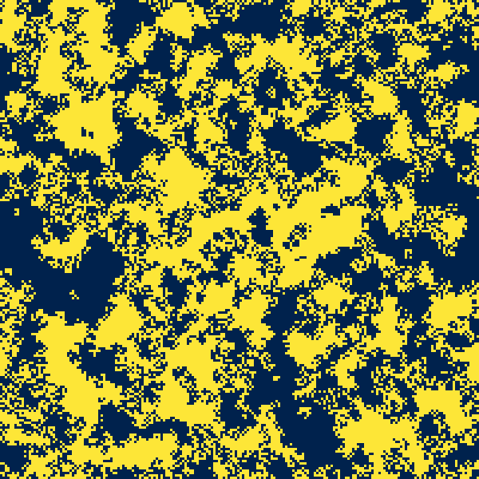
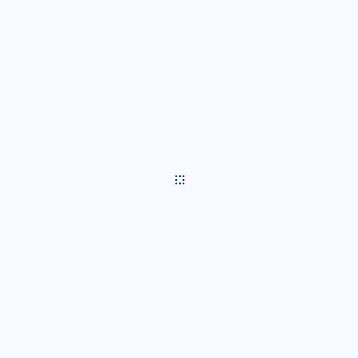

# Game of Life

## Overview

This project implements **Life-like Cellular Automata**, a class of two-dimensional cellular automata similar to **Conway's Game of Life**.
A cellular automaton is life-like if it satisfies the following:
- Operates on a two-dimensional grid of cells.
- Each cell has two states: "alive" (on) or "dead" (off).
- The neighborhood of a cell includes the eight adjacent cells and optionally the cell itself *(i.e. the Moore neighborhood)*.
- The new state of a cell is based only on the number of alive neighbors and the cell's current state *(i.e. the rule is outer totalistic)*.

The project provides a framework for simulating and experimenting with different birth and survival rules of Life-Like Cellular Automata. Below are a few examples.

 <table>
  <tr>
    <td> </td>
    <td></td>
    <td></td>
  </tr>
  <tr>
    <td> </td>
    <td></td>
    <td> <td>
  </tr>
</table> 